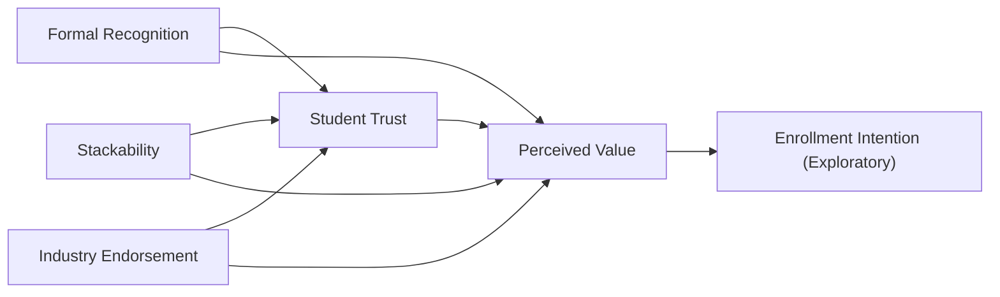

# Framework, Operationalization, and Analysis

## 1. Theoretical engines in simple terms

### Signaling Theory

Simple version: people often cannot directly know the true quality of something, so they judge it by visible signals.

Applied to this study:

- students cannot directly know whether an IT micro-credential will actually help them in the future
- they therefore look for clues
- those clues include formal recognition, stackability, and industry endorsement

Why it matters:

- it explains why design features of the credential itself can shape perception before any real experience with the credential occurs

### Institutional Trust / Legitimacy

Simple version: people trust something more when it appears official, recognized, and institutionally supported.

Applied to this study:

- a credential that is recognized by universities or a national system looks more legitimate
- a credential that appears institutionally embedded is more likely to be trusted

Why it matters:

- it explains why recognition should matter beyond simple usefulness
- it connects micro-credentials to questions of legitimacy, not just convenience

### Human Capital Theory

Simple version: people invest in education when they believe it will improve their skills and future opportunities.

Applied to this study:

- if students believe the credential has real educational or career payoff, they are more likely to see it as valuable

Why it matters:

- it helps explain why perceived value is an important outcome

## 2. Integrated theoretical logic

The study combines these theories into one logic chain:

- credential features act as visible signals
- signals shape student trust and legitimacy judgments
- trust shapes perceived value
- perceived value can also influence exploratory enrollment intention

## 3. Conceptual framework

## 4. Variables

### Independent variables

- `Formal Recognition`
- `Stackability`
- `Industry Endorsement`

These are manipulated experimentally rather than measured by a scale.

### Mediator

- `Student Trust`

### Primary dependent variable

- `Perceived Value of IT Micro-Credentials`

### Secondary exploratory dependent variable

- `Enrollment Intention`

### Control variables

- prior MOOC experience
- prior micro-credential completion
- current study level
- university type
- self-rated familiarity with micro-credentials

## 5. Hypotheses

- H1: Formal recognition positively affects student trust in IT micro-credentials.
- H2: Stackability positively affects student trust in IT micro-credentials.
- H3: Industry endorsement positively affects student trust in IT micro-credentials.
- H4: Student trust positively affects perceived value.
- H5: Formal recognition positively affects perceived value.
- H6: Stackability positively affects perceived value.
- H7: Industry endorsement positively affects perceived value.
- H8: Student trust mediates the effect of formal recognition on perceived value.
- H9: Student trust mediates the effect of stackability on perceived value.
- H10: Student trust mediates the effect of industry endorsement on perceived value.

## 6. Operationalization table

| Variable | Type | Working definition | Operational form | Example items or manipulation |
| --- | --- | --- | --- | --- |
| Formal Recognition | IV | The degree to which the credential is officially acknowledged by universities or a national credit system | Binary vignette manipulation | Recognized by participating Thai universities and recordable in the National Credit Bank System vs not formally recognized |
| Stackability | IV | The degree to which the credential can accumulate toward larger qualifications or credit pathways | Binary vignette manipulation | Can be combined with other short courses for future credit vs standalone certificate only |
| Industry Endorsement | IV | The degree to which the credential is backed by respected industry actors | Binary vignette manipulation | Endorsed by a recognized IT industry body vs no industry endorsement |
| Student Trust | Mediator | Students' belief that the credential is credible, reliable, and worthy of confidence | 5-point Likert composite | "I would trust this credential as a legitimate learning qualification." |
| Perceived Value | DV | Students' overall judgment that the credential provides meaningful benefit relative to the effort required | 5-point Likert composite | "This micro-credential would be valuable for my academic or career development." |
| Enrollment Intention | Exploratory DV | Willingness to pursue the credential in the future | 5-point Likert composite | "I would consider enrolling in this micro-credential if it were available to me." |

## 7. Recommended measurement items

### Student Trust

Use a 5-point Likert scale from `1 = strongly disagree` to `5 = strongly agree`.

- TR1: I would trust this micro-credential as a legitimate learning qualification.
- TR2: This micro-credential appears credible to me.
- TR3: I feel confident that this micro-credential would represent real learning.
- TR4: I would regard this micro-credential as reliable evidence of skill development.
- TR5: This micro-credential appears worthy of serious consideration.

### Perceived Value

Use a 5-point Likert scale from `1 = strongly disagree` to `5 = strongly agree`.

- PV1: This micro-credential would be valuable for my academic or career development.
- PV2: This micro-credential would be worth the time required to complete it.
- PV3: This micro-credential would improve my learning or employability prospects.
- PV4: This micro-credential would be a useful addition to my qualifications.
- PV5: Overall, this micro-credential appears worthwhile.
- PV6: This micro-credential would provide meaningful benefits relative to the effort involved.

### Enrollment Intention

Use a 5-point Likert scale from `1 = strongly disagree` to `5 = strongly agree`.

- EI1: I would consider enrolling in this micro-credential if it were available to me.
- EI2: I would be interested in learning more about this micro-credential.
- EI3: I would be likely to pursue a similar micro-credential in the future.

## 8. Provisional source base

These should guide the literature review and scale refinement:

- Spence (1973) for signaling theory
- Suchman (1995) and related institutional legitimacy literature
- Becker (1964) for human capital theory
- OECD (2021) for micro-credential quality and value
- OECD (2025) for Thailand policy context
- UNESCO Bangkok (2025) for recognition and lifelong learning context

For the trust and value scales, the final thesis should explicitly note that the items are adapted for the micro-credential context and finalized after pilot testing and expert review.

## 9. Experimental design

### Design structure

- randomized `2 x 2 x 2` vignette-based survey experiment
- 3 manipulated factors
- 8 experimental cells

### Factor levels

| Factor | Level 0 | Level 1 |
| --- | --- | --- |
| Formal Recognition | Not formally recognized | Formally recognized |
| Stackability | Standalone certificate only | Stackable toward larger qualification or credit |
| Industry Endorsement | No industry endorsement | Endorsed by recognized IT industry body |

## 10. Sample and fieldwork targets

- Target population: Thai undergraduate and postgraduate students in IT-related majors
- Target sample: 480 usable responses
- Minimum acceptable sample: 320 usable responses
- Preferred allocation: 60 per experimental cell
- Minimum allocation: 40 per experimental cell

## 11. Analysis blueprint

### Step 1: Data cleaning

- remove incomplete responses
- remove respondents who fail screening criteria
- flag inattentive responses using attention checks and very short completion times

### Step 2: Randomization checks

- compare experimental cells on age, study level, university type, prior MOOC experience, and familiarity with micro-credentials
- use chi-square tests for categorical variables and ANOVA for continuous variables where appropriate

### Step 3: Manipulation checks

- confirm that respondents perceived differences in recognition, stackability, and endorsement
- keep the main analysis as intent-to-treat
- report a robustness check excluding clear manipulation failures

### Step 4: Reliability and validity

- Cronbach's alpha for trust, perceived value, and enrollment intention
- item-total correlations
- exploratory factor analysis if needed in the pilot or early full sample stage

### Step 5: Main-effect models

- Regress `Student Trust` on:
  - Recognition
  - Stackability
  - Industry Endorsement
  - Controls
- Regress `Perceived Value` on:
  - Recognition
  - Stackability
  - Industry Endorsement
  - Student Trust
  - Controls

### Step 6: Mediation analysis

- use bootstrap mediation with at least 5,000 resamples
- test indirect effects from:
  - Recognition -> Trust -> Perceived Value
  - Stackability -> Trust -> Perceived Value
  - Industry Endorsement -> Trust -> Perceived Value

### Step 7: Exploratory analysis

- test `Perceived Value -> Enrollment Intention`
- compare UG vs PG students
- compare students with and without prior MOOC or micro-credential experience
- treat interactions among the three experimental factors as exploratory rather than core

## 12. Chapter placement

- Chapter 2:
  - theory explanations
  - variable definitions
  - relationships between variables
- Chapter 3:
  - conceptual framework
  - hypotheses
  - operationalization table
- Chapter 4:
  - experimental design
  - sampling
  - questionnaire structure
  - analysis plan

