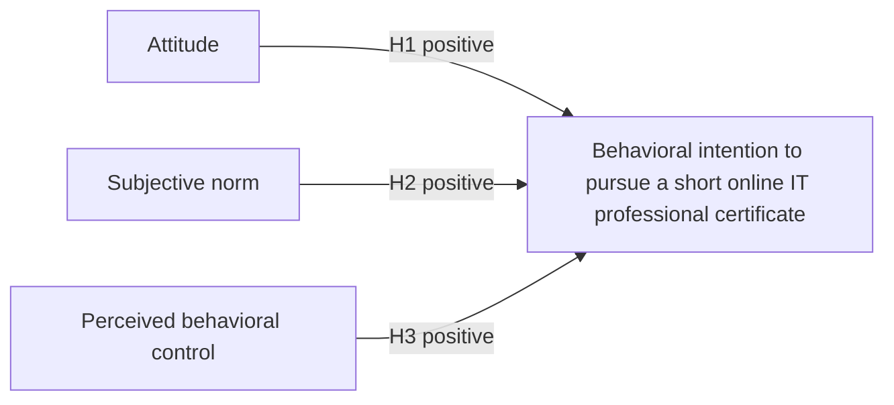

# Recommended Model

## Recommendation

Use a focused four-construct Theory of Planned Behavior model rather than carrying every possible factor into the thesis.

**Proposed caption:** Conceptual framework constructed by the author from the three tested TPB paths in Hunsinger and Smith (2008) and Wang (2023).

This is an author-constructed figure, but none of its constructs or arrows is invented. It retains the three paths that appear and were tested in both published studies.

## Source lineage

| Current element | Direct published source | Evidence location |
| --- | --- | --- |
| Attitude -> Behavioral Intention | Hunsinger & Smith (2006, H1; Figure 2); Hunsinger & Smith (2008, H1); Wang (2023, H3; Figure 1) | Hunsinger 2006 p. 2; Hunsinger 2008 p. 251 and results p. 260; Wang 2023 pp. 26-27 and results pp. 35-37 |
| Subjective Norm -> Behavioral Intention | Hunsinger & Smith (2006, H2; Figure 2); Hunsinger & Smith (2008, H2); Wang (2023, H4; Figure 1) | Same framework and results sections |
| Perceived Behavioral Control -> Behavioral Intention | Hunsinger & Smith (2006, H3; Figure 2); Hunsinger & Smith (2008, H3); Wang (2023, H5; Figure 1) | Same framework and results sections |
| Behavioral Intention as the outcome | Hunsinger & Smith (2006, 2008); Wang (2023) | Model figures, hypotheses, and measures sections |

## Proposed hypotheses

H1: Attitude toward pursuing a short online IT professional certificate is positively related to behavioral intention to pursue such a certificate within the next 12 months.

H2: Subjective norm concerning pursuit of a short online IT professional certificate is positively related to behavioral intention to pursue such a certificate within the next 12 months.

H3: Perceived behavioral control over pursuing a short online IT professional certificate is positively related to behavioral intention to pursue such a certificate within the next 12 months.

Each hypothesis keeps the original construct-to-construct relationship. The only contextual change is the named target behavior.

## Variables in simple terms

- **Attitude:** Does the student think pursuing the certificate is good, positive, and helpful?
- **Subjective norm:** Do people whose opinions matter to the student think the student should pursue it?
- **Perceived behavioral control:** Does the student believe they have the ability, knowledge, skills, money, and resources needed to pursue it?
- **Behavioral intention:** Does the student plan and intend to pursue it within 12 months?

## Why the model is kept small

Hunsinger and Smith also tested Cognition and Affect as predictors of Attitude. Wang also tested Perceived Usefulness and Perceived Ease of Use as predictors of Attitude. Those are legitimate published extensions, but adding them would make the model and questionnaire longer without being necessary to answer the main question.

The four-construct version:

- is the common core of the two closest published frameworks;
- can be tested with one multiple regression;
- stays close to the professor's request for clearly borrowed frameworks and questions; and
- avoids claiming actual certificate completion or employment outcomes.

Actual behavior is omitted because the planned cross-sectional survey measures intention only.

## Required published figures for Chapter 3

Before presenting the author-constructed figure, Chapter 3 should reproduce or accurately excerpt:

1. Hunsinger and Smith's (2006) Figure 2, the published model of IS students' intention to earn IT certification.
2. Wang's (2023) Figure 1, the published TAM-TPB model of undergraduate MOOC intention.

The captions must identify them as figures from the original studies. The new four-construct figure must be separately captioned as constructed by the author.
